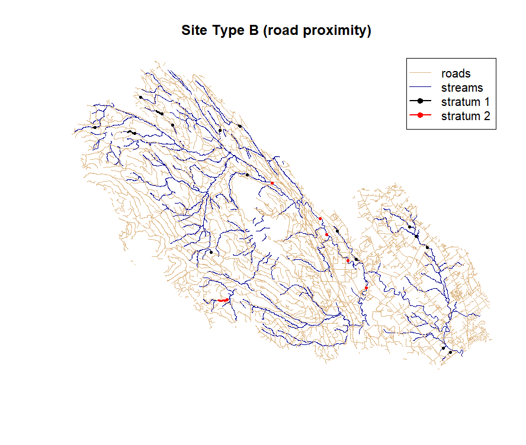
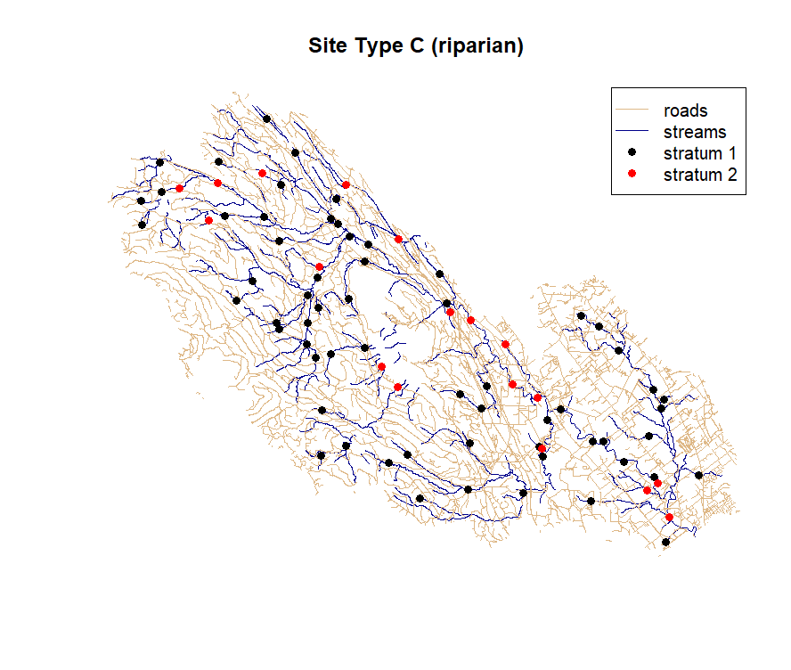

# wsep.t2 #
## *The Watershed Status Evaluation Protocol - Tier 2 R-Package*


<!-- badges: start -->
[](https://www.tidyverse.org/lifecycle/#stable)
[](https://cran.r-project.org/package=MNAI.CPBT)
<!-- badges: end -->

[](https://youtu.be/HxUBpJ-aGSs)

The WSEP Tier 2 field sampling package uses a probabilistic sample design to select sampling sites within a watershed. Each of the three components (fish passage, sediment delivery, and riparian/stream channel) use a different sample design; however, they share underlying spatial data layers. These spatial layers should be compiled and processed early on in any watershed assessment project to help inform reconnaissance and planning. The WSEP Tier 2 R-package (wsep.t2) can be used to help process and assemble the spatial data needed to generate sampling sites for a watershed of interest.

## Installation

The easiest way to install the `wsep.t2` package is from within the [RStudio IDE](https://www.rstudio.com/products/rstudio/download/) using `remotes::install_github()`. At this time the package has not been published to CRAN so the default `install.packages()` will not work. Instead, use remotes [or devtools] to install the package directly from GitHub:

``` r
# You may need to install remotes
library(remotes)
# Choose all if promp to update packages
remotes::install_github("essatech/wsep.t2")
library(wsep.t2)
```

## Example Usage ##

An example dataset is included in the wsep.t2 package for the Tsolum River watershed in Courtenay British Columbia, but the model can be run on any watershed of interest. The following section provides an example for the Tsolum River. It is expected that users will apply the tool to their own watershed of interest; in order to run the model on your own, you will need the following geospatial files: 

1. A streamline network derived from the BCFWA (BC Freshwater Atlas) clipped to their watershed of interest (note ensure the layer used has a field called STREAM_ORDER): https://www2.gov.bc.ca/gov/content/data/geographic-data-services/topographic-data/freshwater
2. A roads vector dataset (spatial lines) within each watershed. We recommend using the output from the BC Road-Integrator (https://github.com/smnorris/roadintegrator) that combines duplicate segments from the DRA & related sources


### Import Stream and Road Data Layers ###

```r
  # Run with sample dataset
  library(wsep.t2)
  data(TsolumStreams)
  strm <- TsolumStreams
  data(TsolumRoads)
  roads <- TsolumRoads
  
  # Import your own data here (update directories and uncomment lines)
  # library(sf)
  # strm <- st_read(dsn = "my_watershed.gdb", layer = "my_streams")
  # roads <- st_read(dsn = "my_watershed.gdb", layer = "my_roads")
  
```
## Create the Stream Layer ##

Before we can generate our sampling sites across a watershed, we first need to refine the stream network sampling frame to fit within the bounds of what is appropriate for sampling (remove micro-drainages that are not relevant for this sampling program; remove lakes and wetlands; remove alpine stream reaches). These pre-processing steps ensure that the field sampling program will be successful and can reduce the frequency of any last-minute adjustments in the field:

1. Reduce the frequency of encountering non-classified drainage (small streams are may be non-existent or intermittent)
2. Remove lakes and lentic wetlands (optional)
3. Remove Alpine areas (optional)
4. Restricted access due to ownership or safety (not included, but recommended)

```r
  # Load the WSEP Tier 2 R-package
  library(wsep.t2)
  
  # Will must re-project our data so that x,y are cartesian coordinates with units of meters
  strm <- utm_projection(data = strm)
  
  # Then constrain the sampling frame to remove 1st order tribs less than 500 m in length and clip the upper 200 m off of other tributaries. see ?constrain_streams for details
  c_ctrm <- constrain_streams(strm = strm,
                              length_remove = 500,
                              length_trim = 200)
  
  # Remove lakes and other lotic reaches.
  # Consider removing any other lakes manually or through a simple filter
  c_strm <- remove_lentic_bcfwa(strm = c_ctrm,
                                EDGE_TYPE = "EDGE_TYPE")
  
  # Remove alpine areas
  # In this example set to all segments over 800 m (adjust this value for your region)
  ca_strm <- remove_alpine_bcfwa(strm = c_strm,
                                 elevation_threshold = 800)
  
  
  # (Optional) Visualize original (raw) and constrained streams.
  # Finalize and adjust with any additional filters
  strm1_plot <- sf::st_zm(strm)
  strm2_plot <- sf::st_zm(ca_strm)
  plot(sf::st_geometry(strm1_plot), col = "lightgrey",
       main = "Constrained Streams")
  plot(sf::st_geometry(strm2_plot), col = "blue", add = TRUE)
  legend("topright", c("original", "adjusted"),
         col = c("lightgrey", "blue"), lwd = 1)
```


### Define Strata as Stream Order ###

Create a new field called `strata` that divides the remaining stream network based on stream order: `stratum_1` < 3rd order streams and `stratum_2` ≥ 3rd order streams.

```r
  ca_strm$strata <- NA
  ca_strm$strata <- ifelse(ca_strm$STREAM_ORDER < 3, "stratum_1", ca_strm$strata)
  ca_strm$strata <- ifelse(ca_strm$STREAM_ORDER >= 3, "stratum_2", ca_strm$strata)
  plot(ca_strm["strata"], main = "Sampling Stratum")
```

## Site Type A: Stream Crossings ##

A list of stream-road crossings in the watershed can be generated by taking the intersection of the stream layer and the road layer. We can then use the new stream crossing layer as our first sampling frame to select sites to assess connectivity (fish passage) and sediment inputs.

The grouped_random_sample() function needs the intersection dataframe (crossings), the divided stream order data from the previous step (“strata”), a sample size (n), and a column name. It will then generate a random sample from the list of stream crossings for each of the two strata (stratum 1: < 3rd order vs. stratum 2: ≥ 3rd order). If the specified sample size is greater than the number of stream crossings in a stratum, then only the limited number of available crossings will be returned. This function returns a spatial dataframe containing site id, strata information, UTM coordinates, type_a designation, and original stream order value.

```r
  # Ensure road spatial projection matches that of the stream layer
  # and that units are in meters (cartesian coordinates)
  roads <- utm_projection(data = roads)
  
  # Define crossings as the intersection of streams and roads
  crossings <- sf::st_intersection(ca_strm, roads)
  
  # Take a random sample of crossings by strata
  site_type_a <- grouped_random_sample(data = crossings,
                                       group_name = "strata",
                                       n = 40,
                                       stream_order = "STREAM_ORDER"
                                       )
  
  # -------------------------------------------
  # (Optional) visualize
  strm_plot <- sf::st_zm(ca_strm)
  road_plot <- sf::st_zm(roads)
  plot(sf::st_geometry(strm_plot), col = "darkblue", main = "Site Type A (stream crossing)")
  plot(sf::st_geometry(road_plot), add = TRUE, col = "burlywood")
  plot(sf::st_geometry(site_type_a), add = TRUE, col = ifelse(site_type_a$strata == "stratum_1", "black", "red"), pch = 19)
  legend("topright", c("roads", "streams", "stratum 1", "stratum 2"), col = c("burlywood", "darkblue", "black", "red"), lwd = c(1, 1, NA, NA), pch = c(NA, NA, 19, 19))
```


## Site Type B: Road Proximity ##

It may also be of interest to sample streams that are in close proximity to roads (Site Type B). The road_proximity_sample() function takes the streams and roads data and outputs a list containing both points and line segments. These are then pulled into site_type_b and line_segments appropriately. The road_proximity_sample function may take a moment to run but will update you with key processing milestones as it works through the following steps:

Sample streams in close proximity to roads.

1.	Create a buffer around streams as per strata (Strata 1 (<3rd order): 20 m and, Strata 2 (≥3rd order): 40 m).
2.	Take the intersection of roads and this buffer.
3.	Removing any stream crossings (ie site_type_a), by excluding any cases within 100 m (default) of a crossing to avoid double counting. (Note: adjust for what you feel is appropriate for your watershed given road density, e.g., 50 m)
4.	Removing any segments < 50 m in length unless they are near a switch-back. This must be determined by a manual review of the map and is not automated in this R-code. (Note: our tutorial removes segments <30 m given road density & density of switchbacks)
5.	Provide the start point of the segment, the segment length, the strata id (<3rd order vs. ≥ 3rd order), and extract the entire segment. This is useful information to have on field maps to facilitate sampling.
6.	Generate a random sample from the Site Type B list the strata with < 3rd order streams.
7.	Append the complete list of Site Type B from the ≥ 3rd order strata.
8.	Create a field checklist with at least the following fields: unique identifier, coordinates of start point and end point, segment length, and Strata.

Note that road_proximity_sample() returns a list object with the sample points and the streamline segments.

```r
  # Run the function for road proximity samples
  ?road_proximity_sample
  
  type_b <- road_proximity_sample(
    n = 60,
    strm = ca_strm,
    roads = roads,
    buffer_s1_m = 20,
    buffer_s2_m = 40,
    buffer_crossings_m = 50, # originally 100m
    small_strm_segment_m = 30, # originally 50m
    stream_order = "STREAM_ORDER"
  )
  # Distances adjusted to provide better fit for this urban watershed
  
  
  # Get the points object
  names(type_b)
  site_type_b <- type_b$points
  line_segments <- type_b$line_segments
  table(site_type_b$strata)

  # # Preview
  # library(mapview)
  # mapview(list(site_type_b, line_segments))
  
  # -------------------------------------------
  # (Optional) visualize
  strm_plot <- sf::st_zm(ca_strm)
  road_plot <- sf::st_zm(roads)
  plot(sf::st_geometry(strm_plot), col = "darkblue", main = "Site Type B (road proximity)")
  plot(sf::st_geometry(road_plot), add = TRUE, col = "burlywood")
  plot(sf::st_geometry(site_type_b), add = TRUE, col = ifelse(site_type_b$strata == "stratum_1", "black", "red"), pch = 19, cex = 0.5)
  plot(sf::st_geometry(line_segments), add = TRUE, col = ifelse(site_type_b$strata == "stratum_1", "black", "red"), lwd = 2.5)
  legend("topright", c("roads", "streams", "stratum 1", "stratum 2"), col = c("burlywood", "darkblue", "black", "red"), lwd = c(1, 1, 2, 2), pch = c(NA, NA, 19, 19))
  
```




## Site Type C: Riparian (Component 3) ##

Lastly, we can sample sites for the riparian component (Site Type C). Riparian sites are selected from each stratum using a spatially balanced design (GRTS, Stevens 2002) from the stream network (constrained version). We have to run the code with each stratum separately but will bind these together to create our site_type_c spatial dataframe. This function also takes a sample size (n), the stream dataset specified by stratum. 

```r
  site_type_c_1 <- strm_grts(
    n = 40,
    strm = ca_strm[which(ca_strm$strata == "stratum_1"), ],
    stream_order = 'STREAM_ORDER'
    )
  
  site_type_c_2 <- strm_grts(
    n = 40,
    strm = ca_strm[which(ca_strm$strata == "stratum_2"), ],
    stream_order = 'STREAM_ORDER'
    )
    
  site_type_c <- rbind(site_type_c_1, site_type_c_2)
  table(site_type_c$strata)
  
  
  # -------------------------------------------
  # (Optional) visualize
  plot(sf::st_geometry(strm_plot), col = "darkblue", main = "Site Type C (riparian)")
  plot(sf::st_geometry(road_plot), add = TRUE, col = "burlywood")
  plot(sf::st_geometry(site_type_c), add = TRUE, col = ifelse(site_type_b$strata == "stratum_1", "black", "red"), pch = 19)
  legend("topright", c("roads", "streams", "stratum 1", "stratum 2"), col = c("burlywood", "darkblue", "black", "red"), lwd = c(1, 1, NA, NA), pch = c(NA, NA, 19, 19))
``` 



```r
  # (Optional) Visualize with Mapview
  # install.packages("mapview")
  # library(mapview)
  # road_plot$col <- 1
  # mapview(list(strm_plot["strata"], road_plot, site_type_a["strata"], site_type_b["strata"], site_type_c["strata"]))
```


## Export Data ##

Finally, when all the sampling frames (above) have been generated it is possible to export the sample sites in neatly formatted csv, shp and kml file formats for review and field planning. Use the `export_sites()` function after defining a local export directory.

```r
    # Output directory
    # Change this path for your computer!
    output_dir <- "C:/Users/mbayly/Desktop/delete/my_sites"

    export_sites(output_dir = output_dir,
                 site_type_a = site_type_a,
                 type_b = type_b,
                 site_type_c = site_type_c,
                 export_csv = TRUE,
                 export_shp = TRUE,
                 export_kml = TRUE)
```


## Sampling Frame Summary Table ##

(Optional) It also is convenient to produce a summary table of the entire sampling frame. This table summarizes the total length of streams by strata and the total count of stream crossings by strata.

```r
# Generate a summary of the sampling frame by strata
# For stream lengths
df1 <- sample_frame_summary(
  strm = strm,
  constrained_strm = ca_strm,
  roads = roads,
  stream_order = "STREAM_ORDER",
  summary_type = "stream_lengths")
print(df1)
  
# and stream crossings
df2 <- sample_frame_summary(
  strm = strm,
  constrained_strm = ca_strm,
  roads = roads,
  stream_order = "STREAM_ORDER",
  summary_type = "stream_crossings")
print(df2)

```

Table 1: Stream length summary by strata and stream type
| Strata    | Unconstrained (m) | Constrained (m) |
|-----------|---------------|-------------|
| Stratum 1 | 326,267        | 230,664      |
| stratum 2 | 102,614        | 94,700       |
| Total     | 428,881        | 325,364      |


Table 2: Stream-road crossing summary by strata and stream type 
| Strata    | Unconstrained (#) | Constrained (#) |
|-----------|---------------|-------------|
| Stratum 1 | 436           | 314         |
| Stratum 2 | 75            | 69          |
| Total     | 511           | 383         |


## Additional Resources ##
- [BC - Forest and Range Evaluation Program fish/watershed monitoring](https://www2.gov.bc.ca/gov/content/industry/forestry/managing-our-forest-resources/integrated-resource-monitoring/forest-range-evaluation-program/frep-monitoring-protocols/fish-watershed)
- [Pickard, D., M. Porter, L. Reese-Hansen, R. Thompson, D. Tripp, B.
Carson, P. Tschaplinski, T. Larden, and S. Casley. 2014. Fish Values:
Watershed Status Evaluation, Version 1.0. BC Ministry of Forests,
Lands and Natural Resource Operations and BC Ministry of the
Environment (MOE), Victoria, BC](https://www2.gov.bc.ca/assets/gov/farming-natural-resources-and-industry/forestry/frep/frep-docs/140402_wse_protocol_april_02_14.pdf)
- [ESSA - Watershed Status Assessments](https://essa.com/explore-essa/projects/watershed-status-assessments/#1512665948945-0b64f385-20c95474-31f6)
