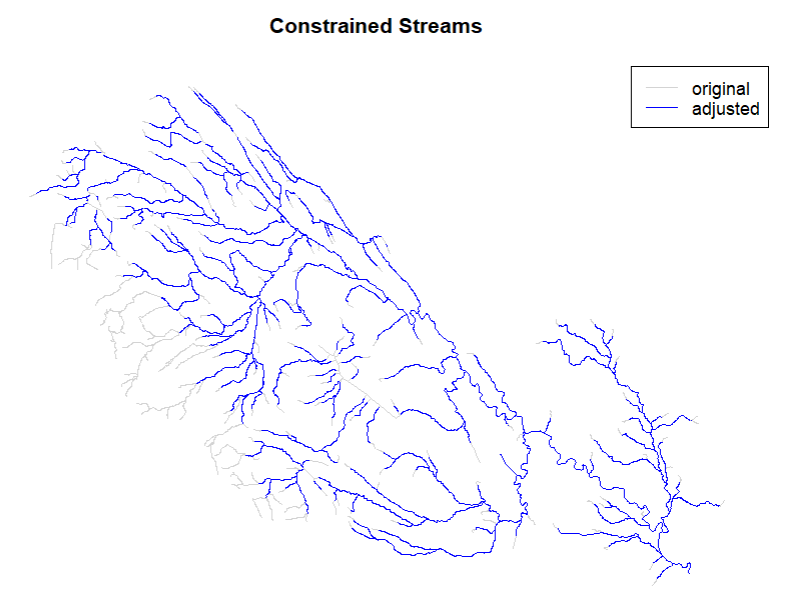
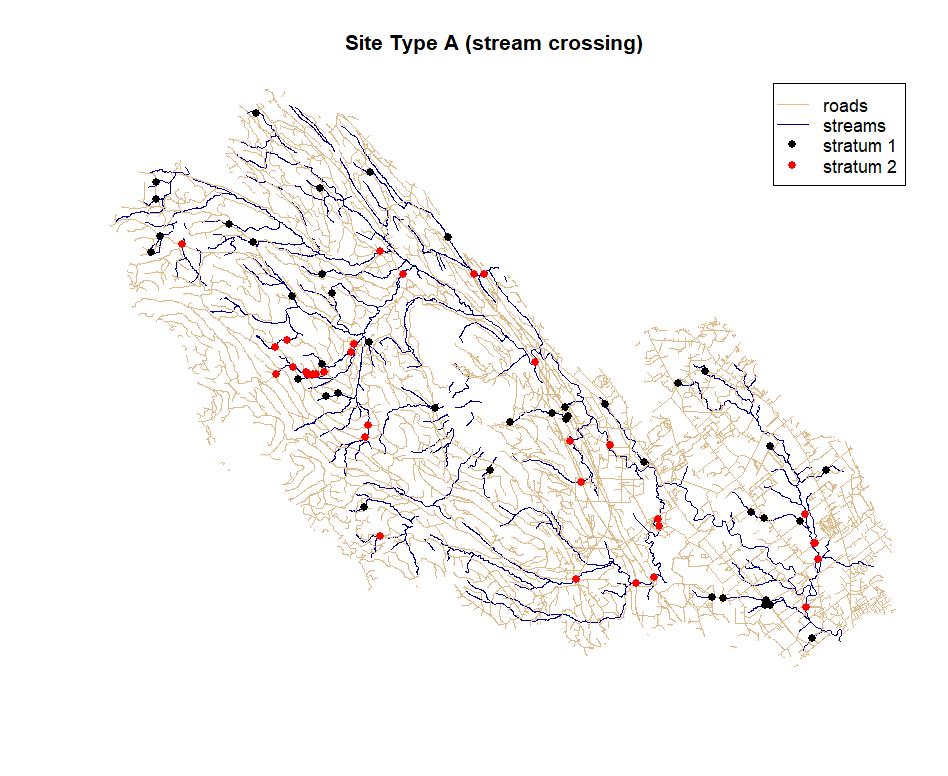

# wsep.t2 #
## *The Watershed Status Evaluation Protocol - Tier 2 R-Package*


<!-- badges: start -->
[](https://www.tidyverse.org/lifecycle/#stable)
[](https://cran.r-project.org/package=MNAI.CPBT)
<!-- badges: end -->

The WSEP Tier 2 field sampling package uses a probabilistic sample design to select sampling sites from the watershed. Each of the three components (fish passage, sediment delivery, and riparian/stream channel) use a different sample design; however, they share underlying spatial data sets. These spatial layers should be compiled and processed early on to inform reconnaissance and planning. The WSEP Tier 2 R-package (wsep.t2) can be used to help process and assemble the spatial data needed to generate sampling sites for a watershed of interest.

## Installation

The easiest way to install the `wsep.t2` package is from within the [RStudio IDE](https://www.rstudio.com/products/rstudio/download/) using `remotes::install_github()`. At this time the package has not been published to CRAN so the default `install.packages()` will not work. Instead, use remotes (or devtools) to install the packge directly from GitHub:

``` r
# You may need to install remotes
library(remotes)
# Choose all if promp to update packages
remotes::install_github("essatech/wsep.t2")
library(wsep.t2)
```

## Example Usage ##

An example dataset is included in the wsep.t2 package for the Tsolum River watershed in Courtenay British Columbia, but the model can be run on any watershed of interest. It is expected that users will start with a streamline network from the BCFWA (BC Freshwater Atlas) clipped to their watershed of interest. Another key data layer to get started is the roads vector line dataset within each watershed. The following section provides an example for the Tsolum River. It is expected that users will apply the tool to their watershed of interest.

### Import Stream and Road Data Layers ###

```r
  # Run with sample dataset
  library(wsep.t2)
  data(TsolumStreams)
  strm <- TsolumStreams
  data(TsolumRoads)
  roads <- TsolumRoads
  
  # Import your own data here (update directories and uncomment lines)
  # library(sf)
  # strm <- st_read(dsn = "my_watershed.gdb", layer = "my_streams")
  # roads <- st_read(dsn = "my_watershed.gdb", layer = "my_roads")
  
```
## Create the Stream Layer ##

Prior to sampling sites across a watershed several pre-processing steps are necessary to refine the stream network sampling frame. These pre-processing steps ensure that the field sampling program will be successful and reduce the probability of last minute adjustments in the field. The pre-processing steps are as follows:

1. Omit non-classified drainage (small streams are may be non-existent or intermittent)
2. Remove lakes and lentic wetlands (optional)
3. Remove Alpine areas (optional)
4. Restricted access due to ownership or safety (not included, but recommended)

```r
  # Load the WSEP Tier 2 R-package
  library(wsep.t2)
  
  # Will must re-project our data so that x,y are cartesian coordinates with units of meters
  strm <- utm_projection(data = strm)
  
  # Then constrain the sampling frame to remove 1st order tribs less than 600m in length and clip the upper 300m off of other tributaries. see ?constrain_streams for details
  c_ctrm <- constrain_streams(strm = strm,
                              length_remove = 600,
                              length_trim = 300)
  
  # Remove lakes and other lotic reaches. Consider removing any other lakes manually or through a simple filter
  c_strm <- remove_lentic_bcfwa(strm = c_ctrm,
                                EDGE_TYPE = "EDGE_TYPE")
  
  # Remove alpine areas - In this example set to all segments over 800 m (adjust for your region)
  ca_strm <- remove_alpine_bcfwa(strm = c_strm,
                                 elevation_threshold = 800)
  
  
  # (Optional) Visualize original (raw) and constrained streams. Finalize and adjust with any additional filters
  strm1_plot <- sf::st_zm(strm)
  strm2_plot <- sf::st_zm(ca_strm)
  plot(sf::st_geometry(strm1_plot), col = "lightgrey",
       main = "Constrained Streams")
  plot(sf::st_geometry(strm2_plot), col = "blue", add = TRUE)
  legend("topright", c("original", "adjusted"),
         col = c("lightgrey", "blue"), lwd = 1)
```



### Define Strata as Stream Order ###
Create a new field called `strata` that divides the remaining stream network based on stream order: `stratum_1` < 3rd order streams and `stratum_2` ≥ 3rd order streams.

```r
  ca_strm$strata <- NA
  ca_strm$strata <- ifelse(ca_strm$STREAM_ORDER < 3, "stratum_1", ca_strm$strata)
  ca_strm$strata <- ifelse(ca_strm$STREAM_ORDER >= 3, "stratum_2", ca_strm$strata)
  plot(ca_strm["strata"], main = "Sampling Stratum")
```

## Site Type A: Stream Crossings ##

A list of stream-road crossings in the watershed can be generated by taking the intersection of the stream layer and the road layer. We can then use the stream crossing layer as our first sampling frame to select sites to assess connectivity (fish passage) and sediment inputs.

Site Type and strata: Generate a random sample from the list of stream crossings for each of the two strata (stratum 1: < 3rd order vs. stratum 2: ≥ 3rd order).

```r
  # Ensure road projection matches stream
  roads <- utm_projection(data = roads)
  
  # Define crossings as the intersection of streams and roads
  crossings <- sf::st_intersection(ca_strm, roads)
  
  # Take a random sample of crossings by strata
  site_type_a <- grouped_random_sample(data = crossings,
                                       group_name = "strata",
                                       n = 20)
  
  # -------------------------------------------
  # (Optional) visualize
  strm_plot <- sf::st_zm(ca_strm)
  road_plot <- sf::st_zm(roads)
  plot(sf::st_geometry(strm_plot), col = "darkblue", main = "Site Type A (stream crossing)")
  plot(sf::st_geometry(road_plot), add = TRUE, col = "burlywood")
  plot(sf::st_geometry(site_type_a), add = TRUE, col = ifelse(site_type_a$strata == "stratum_1", "black", "red"), pch = 19)
  legend("topright", c("roads", "streams", "stratum 1", "stratum 2"), col = c("burlywood", "darkblue", "black", "red"), lwd = c(1, 1, NA, NA), pch = c(NA, NA, 19, 19))
```




## Site Type B: Road Proximity ##

Sample streams in close proximity to roads.

1. Apply a buffer (Strata 1: 20m for < 3rd order and, Strata 2: 40 m for ≥3rd order) streams.
2. Take the intersection of roads and this buffer.
3. Removing any stream crossings (site Type A), by excluding any cases within 100 m of a crossing to avoid double counting.
4. Removing any segments < 50m in length unless they are near a switch-back (determined by manual review of the map). [manual step not automated in R code - added afterwards]
5. Provide the start point of the segment as well as the segment length and strata id (<3rd order vs. ≥ 3rd order) and mapping the entire segment on the field maps to facilitate sampling.
6. Generate a random sample from the Site Type B list the strata with < 3rd order streams.
7. Append the complete list of Site Type B from the ≥ 3rd order strata.
8. Create a field checklist with at least the following fields: unique identifier, coordinates of start point and end point, segment length, and Strata.


```r
  # Run the function for road proximity samples
  ?road_proximity_sample
  
  type_b <- road_proximity_sample(
    n = 20,
    strm = ca_strm,
    roads = roads,
    buffer_s1_m = 20,
    buffer_s2_m = 40,
    buffer_crossings_m = 30, # 100m
    small_strm_segment_m = 20, # 50m
    stream_order = "STREAM_ORDER"
  )
  # Distances adjusted to provide better fit for urban watershed
  
  
  # Get the points object
  names(type_b)
  site_type_b <- type_b$points
  
  # -------------------------------------------
  # (Optional) visualize
  strm_plot <- sf::st_zm(ca_strm)
  road_plot <- sf::st_zm(roads)
  plot(sf::st_geometry(strm_plot), col = "darkblue", main = "Site Type B (road proximity)")
  plot(sf::st_geometry(road_plot), add = TRUE, col = "burlywood")
  plot(sf::st_geometry(site_type_b), add = TRUE, col = ifelse(site_type_b$strata == "stratum_1", "black", "red"), pch = 19)
  legend("topright", c("roads", "streams", "stratum 1", "stratum 2"), col = c("burlywood", "darkblue", "black", "red"), lwd = c(1, 1, NA, NA), pch = c(NA, NA, 19, 19))
```


## Site Type C: Riparian (Component 3) ##

There are several site types for this component. This section provides guidance on how to generate the list of sample sites from the spatial layers above. Generate a GRTS sample from the list of stream crossings for each of the two strata (<3rd order vs. ≥ 3rd order).

```r
  site_type_c <- strm_crossings_grts(n = 20, strm = ca_strm, roads = roads, stream_order = 'STREAM_ORDER')
  
  # -------------------------------------------
  # (Optional) visualize
  plot(sf::st_geometry(strm_plot), col = "darkblue", main = "Site Type C (riparian-crossings)")
  plot(sf::st_geometry(road_plot), add = TRUE, col = "burlywood")
  plot(sf::st_geometry(site_type_c), add = TRUE, col = ifelse(site_type_b$strata == "stratum_1", "black", "red"), pch = 19)
  legend("topright", c("roads", "streams", "stratum 1", "stratum 2"), col = c("burlywood", "darkblue", "black", "red"), lwd = c(1, 1, NA, NA), pch = c(NA, NA, 19, 19))
``` 


```r
  # (Optional) Visualize with Mapview
  # install.packages("mapview")
  # library(mapview)
  # road_plot$col <- 1
  # mapview(list(strm_plot["strata"], road_plot, site_type_a["strata"], site_type_b["strata"], site_type_c["strata"]))
```


## Export Data ##

Finally, when all the sampling frames (above) have been generated it is possible to export the sample sites in neatly formatted csv, shp and kml file formats for review and field planning. Use the `export_sites()` function after defining a local export directory.

```r
    # Output directory
    output_dir <- "C:/Users/mbayly/Desktop/delete/my_sites"

    export_sites(output_dir = output_dir,
                 site_type_a = site_type_a,
                 type_b = type_b,
                 site_type_c = site_type_c,
                 export_csv = TRUE,
                 export_shp = TRUE,
                 export_kml = TRUE)
```


## Additional Resources ##
- [BC - Forest and Range Evaluation Program fish/watershed monitoring](https://www2.gov.bc.ca/gov/content/industry/forestry/managing-our-forest-resources/integrated-resource-monitoring/forest-range-evaluation-program/frep-monitoring-protocols/fish-watershed)
- [Pickard, D., M. Porter, L. Reese-Hansen, R. Thompson, D. Tripp, B.
Carson, P. Tschaplinski, T. Larden, and S. Casley. 2014. Fish Values:
Watershed Status Evaluation, Version 1.0. BC Ministry of Forests,
Lands and Natural Resource Operations and BC Ministry of the
Environment (MOE), Victoria, BC](https://www2.gov.bc.ca/assets/gov/farming-natural-resources-and-industry/forestry/frep/frep-docs/140402_wse_protocol_april_02_14.pdf)
- [ESSA - Watershed Status Assessments](https://essa.com/explore-essa/projects/watershed-status-assessments/#1512665948945-0b64f385-20c95474-31f6)
